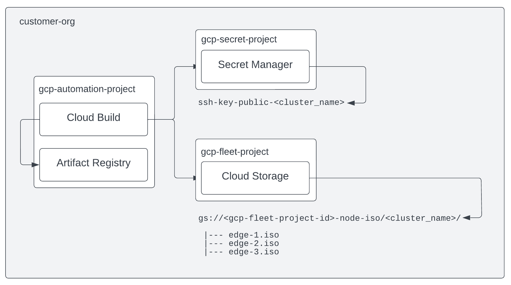

# Creating ISOs Images with Cloud Build #

This option works well in conjunction with automated resource creation using IAC. This example assumes the
usage of the reference Terraform in https://consumer-edge.googlesource.com/iac-deploy/ and
https://consumer-edge.googlesource.com/iac-modules/. Using Cloud Build, it provides a standard and automated process
for stamping out node isos for each cluster in a fleet/org.

Here is a diagram that describes the flow:



## Benefits ##

- No dependency on local build machine requirements
- Automatic population of node ssh public key from Secret Manager
- Output of ISO images to Cloud Storage Bucket in the Cluster Fleet Project

## Pre-Requisites ##

Create the `generate-iso` container by running the cloudbuild.yaml in the *root directory*

```sh
$ export REGION=us-central1 # Modify as needed
$ export CLOUD_BUILD_PROJECT_ID=<cloud_build_project_id>
$ gcloud builds submit . \
  --substitutions _REGION=$REGION,_REPO_NAME=consumer-edge \
  --project $CLOUD_BUILD_PROJECT_ID
```
----

## ISO Creation Steps ##

The following steps will submit a cloud build job to create the iso images and move them into a Cloud Storage bucket in the Fleet project named <FLEET_PROJECT_ID>-node-iso under a folder named <CLUSTER_NAME>. The ISOs will be named according to the hostname selected and will be populated with ssh public keys that were prepopulated in Secret Manager via the Terraform.


1) Set environment variables

```sh
$ export REGION=us-central1 # Modify as needed
$ export CLUSTER_NAME=<cluster_name>
$ export SECRET_PROJECT_ID=<secret_project_id>
$ export FLEET_PROJECT_ID=<fleet_project_id>
$ export CLOUD_BUILD_PROJECT_ID=<cloud_build_project_id>
$ export HOSTNAME_PREFIX=edge
$ export MACHINE_COUNT=3
```

2) Submit the job to generate the ISO(s) and push them to the Cloud Storage bucket in the fleet project.

```sh
$ gcloud builds submit \
  --no-source \
  --config cloudbuild-tf.yaml \
  --substitutions _REGION=${REGION},_CLUSTER_NAME=${CLUSTER_NAME},_SECRET_PROJECT_ID=$SECRET_PROJECT_ID,_FLEET_PROJECT_ID=${FLEET_PROJECT_ID},_HOSTNAME_PREFIX=${HOSTNAME_PREFIX},_MACHINE_COUNT=${MACHINE_COUNT} \
  --project ${CLOUD_BUILD_PROJECT_ID}
```

## Flash ISO to USB(s) ##

1) Download the ISO from the Cloud Storage Bucket to your local machine

2) Use a USB flashing tool to flash ISOs to USB(s)
    * [Rufus](https://rufus.ie/) - Windows
    * [balena Etcher](https://www.balena.io/etcher/) - MacOS
    * [dd](https://man7.org/linux/man-pages/man1/dd.1.html) - Linux and MacOS
